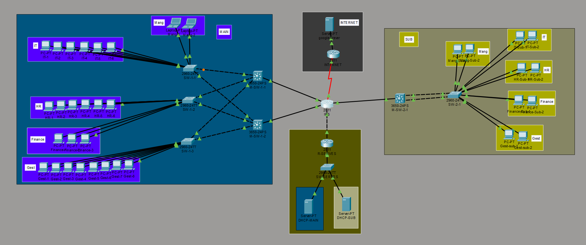

# CCNA-Capstone-Project
# Enterprise Network Infrastructure — CCNA Capstone Project

A complete enterprise network simulation designed and implemented in Cisco Packet Tracer, covering VLAN segmentation, Inter-VLAN Routing, OSPF, HSRP, EtherChannel, DHCP Relay, ACLs, secure SSH-based remote management, NAT/PAT, redundancy, and network security hardening.

## 📌 Project Overview

This project represents a multi-site enterprise network infrastructure consisting of:

- 🏢 Main Site
- 🏭 Sub / Branch Site
- 🧠 Central ISP Router
- 🖥️ Dedicated Server Network
- 🌍 Simulated Internet
- 🔐 Secure SSH Remote Management
- 🔄 Routing and Gateway Redundancy

The network was designed to simulate a real-world enterprise environment where different departments are logically separated using VLANs, routed through Layer 3 switches, protected using ACLs, and connected through redundant routing paths.

**The main focus of the project is:**

Segmentation + Redundancy + Security + Centralized IT Management + High Availability

## 🗺️ Network Architecture


📂 [View all topology screenshots](images/)

```
                         🌍 INTERNET
                              │
                       INTERNET Router
                              │
                         WAN / NAT-PAT
                              │
                        ┌──── ISP ────┐
                        │ Router ID   │
                        │ 1.1.1.1     │
                        └──────┬──────┘
                               │
            ┌──────────────────┼──────────────────┐
            │                  │                  │
            │                  │                  │
        MAIN SITE          SUB SITE          SERVER NETWORK
            │                  │                  │
      ┌─────┴─────┐            │            ┌─────┴─────┐
      │           │            │            │           │
   M-SW-1-1    M-SW-1-2    M-SW-2-1      DHCP-MAIN  DHCP-SUB
      │           │            │
      └─────┬─────┘            │
            │               LACP
      ┌─────┼─────┐            │
      │     │     │         SW-2-1
    SW-1-1 SW-1-2 SW-1-3
      │     │     │
     IT    HR   GUEST
   MANG   FIN
```

## 🏢 1. Main Site

The Main Site is the primary enterprise network.

**Access Layer**

| Switch | Departments |
|---|---|
| SW-1-1 | IT + MANG |
| SW-1-2 | HR + Finance |
| SW-1-3 | Guest |

**Layer 3 Layer**

| Device | Role |
|---|---|
| M-SW-1-1 | Multilayer Switch |
| M-SW-1-2 | Multilayer Switch |

Both Multilayer Switches provide redundant Layer 3 connectivity to the access switches, giving multiple paths between the access layer and the Layer 3 infrastructure.

## 🏭 2. Sub / Branch Site

The Sub Site contains:

| Device | Role |
|---|---|
| M-SW-2-1 | Multilayer Switch |
| SW-2-1 | Access Switch |

The access switch carries all five department VLANs. The connection between M-SW-2-1 and SW-2-1 uses **LACP EtherChannel** — two physical links are combined into one logical Port-Channel, providing link aggregation and redundancy.

## 🏷️ 3. VLAN Architecture

The enterprise uses five department VLANs:

| VLAN ID | Name | Purpose |
|---|---|---|
| 10 | MANG | Management Department |
| 20 | IT | IT Department |
| 30 | HR | Human Resources |
| 40 | FINANCE | Finance Department |
| 50 | GUEST | Guest Network |

### 🔐 Important: SSH Management VLAN

The dedicated network used for remote device management through SSH is **VLAN 222**.

VLAN 222 is specifically used as the Network Device Management VLAN. The IT Department is responsible for managing the network devices remotely through this management network.

## 🧮 4. IP Addressing Plan

**Main Site — Department Networks**

| VLAN | Name | Network | Prefix |
|---|---|---|---|
| 10 | MANG | 192.168.1.96 | /29 |
| 20 | IT | 192.168.1.32 | /27 |
| 30 | HR | 192.168.1.64 | /27 |
| 40 | FINANCE | 192.168.1.104 | /29 |
| 50 | GUEST | 192.168.1.0 | /24 |

**Sub Site — Department Networks**

| VLAN | Name | Network | Prefix |
|---|---|---|---|
| 10 | MANG | 192.168.10.96 | /29 |
| 20 | IT | 192.168.10.32 | /27 |
| 30 | HR | 192.168.10.64 | /27 |
| 40 | FINANCE | 192.168.10.104 | /29 |
| 50 | GUEST | 192.168.10.0 | /24 |

The Main and Sub Sites use separate IP addressing spaces, allowing the same VLAN structure to be maintained across both sites while keeping the networks logically separated.

## 🔐 5. Device Management Network — VLAN 222

The project separates user VLANs from the dedicated network used to manage network devices.

**Sub Site SSH Management**

- Management VLAN: 222
- SW-2-1 → 100.100.100.22/24
- Management Router/Gateway → 100.100.100.1

The management network is dedicated to secure administrative access to network infrastructure.

**Main Site Device Management**

The Main Site also uses dedicated management IP addressing for network devices.

```
SW-1-1   → 22.22.22.1/24
SW-1-2   → 22.22.22.2/24
SW-1-3   → 22.22.22.3/24
M-SW-1-1 → 22.22.22.10/24
M-SW-1-2 → 22.22.22.20/24
```

IT administrators are responsible for remotely managing the network infrastructure using SSH.

## 👨‍💻 6. Centralized IT Network Management

The IT Department is the administrative team responsible for network device management. The IT team uses secure SSH access to manage access switches, multilayer switches, routers, and network infrastructure.

The design separates:

```
USER TRAFFIC                    DEVICE MANAGEMENT
     │                                │
     ├── IT                           └── VLAN 222
     ├── HR                                │
     ├── Finance          VS.              └── SSH
     ├── Guest                                  │
     └── MANG                                   └── IT Administrators
```

This prevents normal user networks from being used directly for administrative access to network infrastructure.

## 🧠 7. Central ISP Router

The central router is named **ISP**, Router ID **1.1.1.1**. It contains five interfaces:

| Interface | Network | Connected To | Purpose |
|---|---|---|---|
| Fa0/0 | 10.0.0.0/8 | M-SW-1-1 | Main Path |
| Fa0/1 | 20.0.0.0/8 | M-SW-1-2 | Main Second Path |
| Fa1/1 | 30.0.0.0/8 | M-SW-2-1 | Sub Site |
| Fa1/0 | 40.0.0.0/8 | R-SERVE | Server Network |
| Se0/3/0 | 200.0.0.0/8 | INTERNET | WAN / Internet |

The Main Site therefore has two Layer 3 paths toward the ISP.

## 🛣️ 8. OSPF Routing

The project uses **OSPF Area 0** for dynamic routing between the different network segments.

OSPF provides dynamic route exchange, automatic route calculation, redundant paths, fast convergence, and Equal-Cost Multi-Path routing where applicable.

Router ID: ISP → 1.1.1.1

## 🛣️ 9. Static Routing

Static routes are also implemented where required, allowing comparison between manually configured routes and dynamically learned routes.

## 🔄 10. HSRP — First Hop Redundancy

HSRP is configured on the Main Site Multilayer Switches:

```
             Virtual Gateway
                    │
          ┌─────────┴─────────┐
          │                   │
     M-SW-1-1             M-SW-1-2
      Active                Standby
```

`preempt` is configured so the preferred device can regain its active role when it becomes available again. HSRP provides default gateway redundancy, high availability, and protection against gateway failure.

## 🔗 11. EtherChannel — LACP

The Sub Site uses LACP between M-SW-2-1 and SW-2-1 — two physical links operate as a single logical Port-Channel.

Benefits: link redundancy, increased bandwidth, better utilization of physical links, simplified STP topology.

## 🌳 12. Spanning Tree Protocol

STP is implemented to prevent Layer 2 loops created by redundant physical paths. The Main Site contains multiple physical paths between switches, making STP essential for loop prevention, redundant link management, path selection, and network stability.

The project demonstrates the interaction between STP + EtherChannel + Layer 3 Redundancy.

## 🖥️ 13. DHCP Infrastructure

The project contains two DHCP servers:

| Server | IP |
|---|---|
| DHCP-MAIN | 100.100.100.10 |
| DHCP-SUB | 100.100.100.20 |

DHCP Relay is implemented using `ip helper-address` on the VLAN interfaces, allowing clients in different VLANs to obtain their IP configuration from centralized DHCP servers.

## 🔒 14. ACL — Finance Security Policy

A dedicated Finance ACL controls Finance traffic, allowing Finance users to reach the required Finance resources in the Sub Site while allowing the required DHCP communication.

This demonstrates: VLAN Segmentation + ACL Traffic Filtering → Controlled Communication.

## 🌍 15. NAT Overload / PAT

The ISP router provides Internet connectivity using NAT Overload / PAT. Internal private networks are translated before accessing the simulated external Internet.

```
MAIN ──────┐
           │
SUB ───────┼──> ISP ──> NAT/PAT ──> INTERNET
           │
SERVERS ───┘
```

The external Internet is represented by a separate router and simulated Google server.

## 🛡️ 16. Network Security Hardening

- SSH-only remote access
- Telnet disabled
- Local user authentication
- `enable secret`
- Login attack protection using `login block-for`
- Dedicated device-management network
- VLAN segmentation
- ACL-based traffic filtering
- Controlled IT administrative access

The objective is to ensure that network infrastructure is managed securely rather than exposing administrative access to normal users.

## 🔄 17. Redundancy & High Availability

**Main Site**

```
                 ISP
                /   \
               /     \
          M-SW-1-1  M-SW-1-2
             \       /
              \     /
             Access
             Switches
```

Benefits from: redundant Layer 3 paths, OSPF, OSPF ECMP where applicable, HSRP, STP, multiple physical links.

**Sub Site**

Uses: LACP EtherChannel, Layer 3 routing, VLAN segmentation.

## 🧪 18. Technologies Demonstrated

**Switching:** VLANs, Access Ports, Trunking, 802.1Q, STP, EtherChannel, LACP, Layer 2 Switching

**Routing:** Inter-VLAN Routing, Static Routing, OSPF, OSPF Area 0, ECMP, HSRP, Layer 3 Switching

**IP Services:** DHCP, DHCP Relay, `ip helper-address`, NAT, PAT, SSH

**Security:** VLAN Segmentation, ACL, SSH Authentication, Local User Accounts, Enable Secret, Login Protection, Dedicated Management VLAN

**Infrastructure:** Main Site, Sub / Branch Site, Server Network, WAN, Simulated Internet, Redundant Network Design

## 📊 19. Project at a Glance

| Category | Implementation |
|---|---|
| Sites | Main + Sub |
| Department VLANs | 5 |
| Device Management VLAN | 222 |
| Layer 2 Switches | Multiple |
| Layer 3 Switches | Multiple |
| Routers | ISP + R-SERVE + INTERNET |
| Dynamic Routing | OSPF |
| Static Routing | ✅ |
| First-Hop Redundancy | HSRP |
| Link Aggregation | LACP |
| Loop Prevention | STP |
| DHCP | Centralized |
| DHCP Relay | ip helper-address |
| Remote Management | SSH |
| Network Administrator | IT Department |
| Traffic Filtering | ACL |
| Internet Access | NAT/PAT |
| Security Hardening | ✅ |
| Redundancy | ✅ |
| Multi-Site Architecture | ✅ |

## 🎯 20. Project Objectives

The project was designed to demonstrate the ability to:

1. Design a multi-site enterprise network.
2. Segment departments using VLANs.
3. Implement Layer 3 Inter-VLAN Routing.
4. Configure OSPF dynamic routing.
5. Configure Static Routing.
6. Implement HSRP for gateway redundancy.
7. Implement LACP EtherChannel.
8. Configure DHCP and DHCP Relay.
9. Secure network devices using SSH.
10. Use a dedicated management VLAN for network infrastructure.
11. Enable the IT Department to manage network devices remotely.
12. Implement ACL-based traffic filtering.
13. Configure NAT/PAT for Internet connectivity.
14. Build a redundant and fault-tolerant network.
15. Apply network security hardening.
16. Troubleshoot connectivity and routing problems.

## 🧭 21. How to Read the Topology

If you're viewing the Packet Tracer topology for the first time:

**1️⃣ Identify the Sites**
- 🔵 Blue — Main Site
- 🟢 Olive — Sub / Branch Site

**2️⃣ Identify the Department VLANs**
- VLAN 10 → MANG
- VLAN 20 → IT
- VLAN 30 → HR
- VLAN 40 → FINANCE
- VLAN 50 → GUEST

**3️⃣ Identify the Device Management Network**

```
VLAN 222 → SSH Management → IT Department → Network Devices
```

**4️⃣ Follow the Routing**

```
Users → Access Switch → Multilayer Switch → OSPF → ISP → NAT/PAT → Internet
```

**5️⃣ Identify Redundancy**

Look for: HSRP, OSPF ECMP, STP, LACP EtherChannel, Redundant Layer 3 Paths

**6️⃣ Identify the Services**

DHCP-MAIN, DHCP-SUB, NAT/PAT, Internet Server

## 🏆 Final Summary

This project is a complete enterprise network simulation built in Cisco Packet Tracer as a practical CCNA Capstone Project.

It combines Layer 2 switching, VLAN segmentation, STP, LACP EtherChannel, Layer 3 switching, Inter-VLAN Routing, OSPF, Static Routing, HSRP, DHCP Relay, ACLs, SSH, NAT/PAT, network security hardening, redundancy, and multi-site connectivity into a single integrated infrastructure.

The IT Department is responsible for network administration, while VLAN 222 is dedicated to secure SSH-based management of network devices.

The main objective was not simply to achieve connectivity, but to build a network that is structured, secure, redundant, manageable, and scalable, similar to a real enterprise environment.
